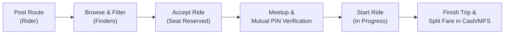

# 🚗 ShareFare — Smart Road Rides & Shared Fares

[](https://flutter.dev)
[](https://dart.dev)
[](https://firebase.google.com)
[](#getting-started)
[](#license)

> **ShareFare** is a peer-to-peer urban ride-sharing and cost-splitting application tailored specifically for commuters, students, and professionals in **Dhaka, Bangladesh**. Instead of high-commission commercial ride hailing, ShareFare empowers daily travelers to connect, coordinate road journeys, and split travel expenses transparently.

---

## 📌 Table of Contents

- [Vision & Key Features](#-vision--key-features)
- [How It Works](#-how-it-works)
- [Safety & Verification System](#-safety--verification-system)
- [Vehicle Types & Seat Capacities](#-vehicle-types--seat-capacities)
- [Comprehensive Dhaka Locations](#-comprehensive-dhaka-locations)
- [Application Screens & User Flow](#-application-screens--user-flow)
- [Architecture & Tech Stack](#-architecture--tech-stack)
- [Project Directory Structure](#-project-directory-structure)
- [Data Models & State Management](#-data-models--state-management)
- [Getting Started & Installation](#-getting-started--installation)
- [Configuration & Firebase Setup](#-configuration--firebase-setup)
- [Contributing & License](#-contributing--license)

---

## 🌟 Vision & Key Features

Navigating Dhaka’s traffic in cars, CNG auto-rickshaws, and rickshaws can be costly and inefficient. **ShareFare** solves this by facilitating micro-carpooling and shared road rides across major Dhaka hubs (such as university campuses like AUST, BUET, and DU, and business districts like Gulshan, Banani, Motijheel, and Dhanmondi).

### 🚀 Highlights

- **Fair Fare Splitting**: Automatically divides the total trip fare evenly among the ride creator and all active finders in real time (`splitFare = totalPrice / totalPeople`).
- **Mutual 4-Digit PIN Verification**: Both the ride creator (Rider) and the joiner (Finder) receive unique PINs. Both parties must verify each other's PIN before the trip can officially begin.
- **Gender-Conscious Travel**: Support for gender preferences (**Anyone**, **Boy / Boys Only**, **Girl / Girls Only**) to ensure passenger comfort and safety.
- **5-Minute Fair Cancellation Window**: Finders can cancel an accepted ride within 5 minutes (with a live countdown). After 5 minutes, cancellation is locked to safeguard the driver/creator against sudden drop-offs.
- **Single Active Ride Safeguard**: Users cannot post new routes or accept concurrent rides if they already have an active ride in progress.
- **Dhaka-Centric Location Autocomplete**: Built-in directory of 90+ recognizable Dhaka neighborhoods, road intersections, and educational institutions, with a custom location fallback.
- **Minimalist High-Contrast UI**: Modern monochrome black-and-white visual identity with clean borders and high accessibility.
- **Cloud Authentication**: Backed by Google Firebase Authentication with real-time email verification, profile creation, and password reset flows.

---

## 🔄 How It Works



1. **Post a Route**: A user going from Point A to Point B creates a route post specifying departure time, vehicle type (Car, CNG, Rickshaw), total cost, allowed finders, and gender preferences.
2. **Find & Join**: Other commuters search and filter available routes matching their commute and tap **Accept Ride**.
3. **Coordinate & Verify**: Both parties view phone numbers and exchange unique 4-digit security PINs upon physical meetup.
4. **Complete & Record**: Once verified, the trip begins and, upon arrival, is marked complete. The trip is logged to both users' activity history and wallet statistics.

---

## 🛡️ Safety & Verification System

Safety and mutual trust are at the heart of ShareFare:

### 1. Two-Way PIN Exchange
- **Rider PIN**: Generated when a ride is posted. The Finder must enter this PIN in their app to verify the Rider.
- **Finder PIN**: Generated when a Finder accepts a ride. The Rider must enter this PIN in their app to verify the Finder.
- **Trip Unlock**: The `START RIDE` button is disabled until all joined co-travelers are mutually verified.

### 2. Gender Safety Filters
- Creators can set a ride to **Anyone**, **Boy**, or **Girl**.
- If a ride is designated **Girls Only**, male accounts are strictly prevented from joining, and vice versa.

### 3. Grace Cancellation Limit
- When a Finder accepts a ride, a **300-second (5-minute)** countdown begins.
- Finders can cancel freely within this window if their schedule changes.
- Once the window elapses, the cancellation button locks to protect the Rider from last-minute cancellations.

---

## 🛺 Vehicle Types & Seat Capacities

ShareFare enforces capacity limits based on local Dhaka transportation rules:

| Vehicle Type | Max Total Passengers | Max Joiners (Finders) | Typical Use Case |
| :--- | :---: | :---: | :--- |
| **🚗 Car** | 4 | 3 | Office commute via flyovers, inter-district routes |
| **🛺 CNG (Auto-Rickshaw)** | 3 | 2 | Medium distance trips across Dhaka |
| **🚲 Rickshaw** | 2 | 1 | Short campus trips, neighborhood travel |

---

## 🗺️ Comprehensive Dhaka Locations

The app includes built-in suggestions (`kDhakaPlaces`) for over 90 locations across Dhaka North and South:

- **Campuses**: AUST Campus, BUET Campus, Dhaka University (TSC), etc.
- **Central & Commercial**: Gulshan 1 & 2, Banani, Motijheel, Kawran Bazar, Panthapath, Banglamotor, Farmgate.
- **Residential**: Dhanmondi (27, 32), Uttara (Sectors 1–14), Mirpur (1, 2, 10, 11, 12, 14), Bashundhara R/A, Baridhara, Mohammadpur, Lalmatia, Shantinagar.
- **Historic & Suburbs**: Old Dhaka, Lalbagh, Sadarghat, Jatrabari, Savar, Ashulia, Tongi, Gazipur Bypass, Narayanganj.

> Users can also type and select **any custom location** if their pickup or drop-off point is not in the predefined list.

---

## 📱 Application Screens & User Flow

```
[Splash Screen] ──▶ [Login / Register] ──▶ [Home Feed]
                                              │
              ┌───────────────────────────────┼───────────────────────────────┐
              ▼                               ▼                               ▼
       [Home Feed]                    [Activity Screen]               [Account Screen]
       ├── Search & Filter Chips      └── Completed Trip Cards        ├── User Profile
       ├── Post a Route               └── Fare & Co-traveler Info     ├── Saved Money Metric
       ├── Available Rides List                                       └── Sign Out
       └── Active Ride Banner
              │
              ├──▶ [Post Route (NewRide)] ──▶ Location Picker ──▶ Post Success (PIN)
              │
              ├──▶ [Ride Details] ─────────▶ Accept Ride / Verify PIN
              │
              └──▶ [Active Ride Screen] ───▶ Real-time Coordination ──▶ Finish Trip
```

### 1. `SplashScreen` (`splash.dart`)
- Clean black splash screen displaying the brand logo (`assets/SFlogo.png`).
- Initializes Firebase, checks authentication state, and routes to `Home` or `LoginScreen`.

### 2. `LoginScreen` & `RegisterScreen` (`login.dart`, `register.dart`, `forgot_password.dart`)
- Email & password authentication with client-side format and length validation.
- Gender selection required during registration (**Male** / **Female**) for gender-based ride matching.
- Phone number validation to ensure smooth passenger-rider communication.
- Password reset email delivery via Firebase Auth.

### 3. `Home` & `HomeFeed` (`home.dart`)
- Bottom navigation with 3 primary tabs: **Home**, **Activity**, and **Account**.
- **Search bar**: Filter by pickup or destination keyword.
- **Filter chips**: Quick filter for **All**, **Boy**, or **Girl** routes.
- **Action cards**: Quick actions to **Post a Route** or view the **How It Works** guide.
- **Persistent Active Ride Banner**: Pops up at the bottom of the screen if the user currently has an active route post or accepted ride.

### 4. `NewRide` (`new_ride.dart`)
- Step-by-step route creation:
  - Pickup and destination picker with search.
  - Vehicle selector (Car, CNG, Rickshaw) with auto-capped co-traveler counter.
  - Gender preference toggle (**Boy**, **Girl**, **Anyone**).
  - Date & time pickers (formatted as *Today/Tomorrow • hh:mm a*).
  - Fare input in Bangladeshi Taka (৳).
  - Optional trip notes (e.g., luggage, specific landmark).

### 5. `RideDetails` (`ride_details.dart`)
- Comprehensive overview of the route, creator profile, vehicle type, and departure time.
- Dynamic per-person fare breakdown (`৳ splitFare / person`).
- Actions for Finders to accept the ride or view active PIN verification cards.
- Quick copy button for the creator's phone number.

### 6. `ActiveRideScreen` (`active_ride.dart`)
- **For Riders**: Shows list of joined co-travelers, their verification status, input field to verify finder PINs, `START RIDE`, and `FINISH TRIP` buttons.
- **For Finders**: Displays assigned Finder PIN, input field to enter the Rider PIN, and a 5-minute cancellation button.

### 7. `ActivityScreen` (`activity.dart`)
- History list of all completed trips.
- Displays date, vehicle type icon, origin, destination, co-travelers, and split fare paid.

### 8. `AccountScreen` (`account.dart`)
- User avatar, name, registered email, and gender.
- **ShareFare Wallet Card**: Displays completed trip counter and total estimated money saved by sharing fares.
- Secure sign-out action.

---

## 🏗️ Architecture & Tech Stack

The project adheres to a clean, service-oriented architecture:

```
┌────────────────────────────────────────────────────────┐
│                      UI Layer                          │
│   (Stateful/Stateless Widgets, ListViews, Dialogs)    │
└───────────────────────────▲────────────────────────────┘
                            │ listens via ChangeNotifier
┌───────────────────────────┴────────────────────────────┐
│                    Service Layer                       │
│  - RideService (Singleton, ChangeNotifier, Ride State) │
│  - AuthService (Singleton, Firebase Auth wrapper)      │
└───────────────────────────▲────────────────────────────┘
                            │
┌───────────────────────────┴────────────────────────────┐
│                 Data & Model Layer                     │
│  - AppUser, RideOffer, JoinedFinder, TripHistoryItem   │
│  - Dhaka Places Dataset (kDhakaPlaces)                 │
└────────────────────────────────────────────────────────┘
```

- **Frontend**: Flutter (Material 2/3 custom styling with high contrast theme).
- **Language**: Dart (SDK 3.13.1+).
- **Backend / Authentication**: Firebase Core (`^4.15.0`) & Firebase Auth (`^6.7.0`).
- **State Management**: `ChangeNotifier` with Singleton services (`RideService`, `AuthService`).
- **Date & Number Formatting**: `intl` package (`^0.20.3`).
- **Local Persistence**: `shared_preferences` (`^2.5.5`).

---

## 📂 Project Directory Structure

```text
Share_Fare/
├── android/                             # Android native platform code
│   ├── app/
│   │   ├── build.gradle.kts             # Gradle app-level build config
│   │   ├── google-services.json         # Firebase Android credentials
│   │   └── src/main/
│   │       ├── AndroidManifest.xml      # Android permissions & activity declarations
│   │       ├── kotlin/AUST/PROJECT/share_fare/
│   │       │   └── MainActivity.kt      # Main Activity (Focus highlight handled)
│   │       └── res/
│   │           ├── values/styles.xml    # Android Launch & Normal theme styles
│   │           └── values-night/styles.xml
│   └── settings.gradle.kts
├── assets/
│   └── SFlogo.png                       # ShareFare car brand icon & splash logo
├── lib/
│   ├── account.dart                     # Account profile, savings metrics, logout
│   ├── active_ride.dart                 # Active trip room & mutual PIN validation
│   ├── activity.dart                    # Completed trip history
│   ├── auth_service.dart                # Firebase authentication business logic
│   ├── firebase_options.dart            # Firebase platform configuration
│   ├── forgot_password.dart             # Password reset email submission
│   ├── home.dart                        # Main dashboard, search feed, active banner
│   ├── login.dart                       # Sign-in screen with email validation
│   ├── main.dart                        # App entrypoint & global ThemeData setup
│   ├── models.dart                      # Core models, validation, and Dhaka places
│   ├── new_ride.dart                    # Route posting wizard & place picker
│   ├── register.dart                    # Registration with gender & phone validation
│   ├── ride_details.dart                # Offer details, fare calculation, acceptance
│   ├── ride_service.dart                # Central state manager for rides and trips
│   └── splash.dart                      # Splash screen with auto-routing
├── analysis_options.yaml                # Static code analysis configuration
├── pubspec.yaml                         # Flutter dependencies and assets manifest
└── README.md                            # Comprehensive project documentation
```

---

## 🧩 Data Models & State Management

### 1. `AppUser`
Represents an authenticated user:
- `id`: Unique user identifier (Firebase UID).
- `name`: Full display name.
- `email`: Registered email address.
- `phone`: Mobile number for coordination.
- `gender`: 'Male' or 'Female'.
- `rating`: User rating (default `4.95`).

### 2. `RideOffer`
Represents a posted route available in the feed:
- `id`, `creatorId`, `creatorName`, `creatorPhone`, `creatorGender`
- `origin`, `destination`, `viaStops`
- `departureTime`: Human-readable date and time.
- `maxFinders`: Maximum allowable co-travelers (1–3 depending on vehicle).
- `totalPrice`: Total trip cost in BDT.
- `genderPreference`: 'Anyone', 'Boy', or 'Girl'.
- `vehicleType`: 'Car', 'CNG', or 'Rickshaw'.
- `riderPin`: 4-digit secret PIN generated for the creator.
- `joinedFinders`: List of active `JoinedFinder` records.
- Computed getters:
  - `activeFinders`: Finders who have not canceled.
  - `availableSeats`: Remaining empty seats.
  - `splitFare`: `totalPrice / (activeFinders.length + 1)`.

### 3. `JoinedFinder`
Represents a user who accepted a ride:
- `userId`, `userName`, `userPhone`, `gender`
- `finderPin`: 4-digit secret PIN generated for the finder.
- `joinedAt`: Timestamp used for the 5-minute cancellation window.
- `finderVerifiedRider`: Boolean flag when Finder enters Rider's PIN.
- `riderVerifiedFinder`: Boolean flag when Rider enters Finder's PIN.
- `bothVerified`: True when both parties have verified each other.

---

## ⚡ Getting Started & Installation

### Prerequisites

1. **Flutter SDK**: `^3.13.1` or higher ([Install Flutter](https://docs.flutter.dev/get-started/install)).
2. **Android Studio** or **VS Code** with Flutter & Dart extensions.
3. **Android SDK** (API Level 26+ recommended; tested through Android 15/16).
4. **Java Development Kit (JDK)**: JDK 17 or higher.

### Step-by-Step Setup

1. **Clone the Repository**:
   ```bash
   git clone https://github.com/your-username/Share_Fare.git
   cd Share_Fare
   ```

2. **Install Flutter Dependencies**:
   ```bash
   flutter pub get
   ```

3. **Verify Connected Devices**:
   ```bash
   flutter devices
   ```

4. **Run the Application**:
   ```bash
   flutter run
   ```

5. **Build APK (Debug or Release)**:
   ```bash
   # Debug APK
   flutter build apk --debug

   # Release APK
   flutter build apk --release
   ```

---

## ⚙️ Configuration & Firebase Setup

The project uses Firebase Authentication for identity management.

1. Ensure `android/app/google-services.json` is present in the `android/app/` folder.
2. In the [Firebase Console](https://console.firebase.google.com/):
   - Navigate to **Authentication** > **Sign-in method**.
   - Enable the **Email/Password** provider.
3. If connecting a new Firebase project, run:
   ```bash
   flutterfire configure
   ```
   This will update `lib/firebase_options.dart` and `google-services.json` automatically.

---

## 📄 License

This project is developed for educational and transportation-improvement purposes. All rights reserved.

---

<p align="center">
  <b>ShareFare</b> — Smart Road Rides & Shared Fares for Dhaka.<br>
  Built with ❤️ using Flutter & Firebase.
</p>
